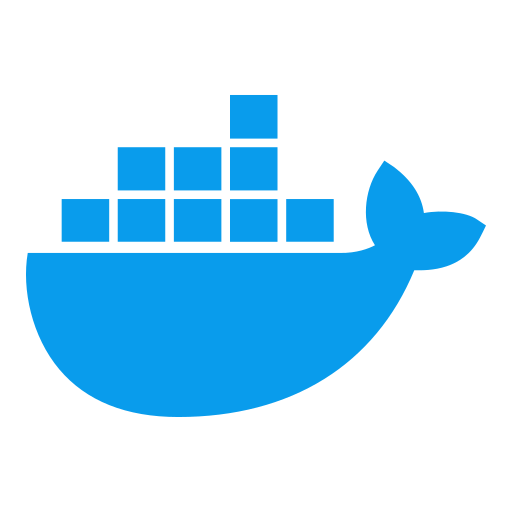

## Hi there 👋

I'm interested in infrastructure engineering and system design, and enjoy figuring out how to build systems that are reliable and scale well.

### Tech Stack
&ensp;
&ensp;
&ensp;
&ensp;
&ensp;
&ensp;
&ensp;
&ensp;

